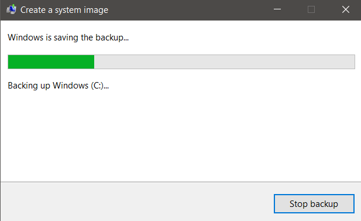

# Windows Backup Lab

## Objective
This lab was designed to enhance my understanding of the computer back-up process, especially in relation to Windows machines and the built-in tools provided by the Windows operating system for creating images and performing system restorations. To that end, the lab consisted of backing up my personal Windows machine and then restoring my machine from this newly created backup. Although this lab was relativley simple, effective backup systems are vital in the IT world. They provide a large degree of protection against ransomware, system defects, and even catastrophic failures, and can be the difference between success and failure in meeting SLA requirements. This lab was used to build my understanding of this process, and will be used as a foundation to advance into more complicated backup tools like Veeam. 

### Skills Learned

- Developed a hands-on understanding of creating a Windows image and restoring from this image
- Strengthened ability to respond to both cybersecurity events, such as ransomware incidents, as well as general system failures
- Improved general IT knowledge and understanding of the Windows operating system
- Development of critical thinking and problem-solving skills in Information Technology

### Tools Used

- Windows 10
- Windows 7 Backup and Restore

## Steps
The first step in this lab was to actually create the image of the Windows machine. To do this, we used a built-in tool for Windows 10 called Windows 7 Backup and Restore. To find this tool, one goes to the Windows Settings page, and then select Update and Security. From here, one selects the Files Backup option from the menu on the left hand side. Finally, the user selects 'Go to Backup and Restore (Windows 7)' just below the 'Looking for an older backup?' subtitle. 

  

  *Ref. 1: The link which takes the user to the Backup and Restore tool in the Windows 10 settings page*

Once the tool had been selected and identified, we then had to use it to create the backup. In this instance, we had an external drive already connected to our laptop via USB, and it was to this drive that we saved the image of our PC. To start this process, the user selects the 'Create a system image' link on the top left-hand side of the new Backup and Restore window. 

  

  *Ref. 2: An image of the Backup and Restore tool user interface*

After selecting the appropriate option, the Backup tool will scan your PC, specifically looking for suitable backup drives to which it might save the system image. There may be several different options depending on the system, including a network share, physical drive, or even a DVD. In my case, I simply selected the physical drive option, and navigated to the external drive that I had connected for this lab. 

  

  *Ref. 3: The menu for selecting the save location for the system image*

Next, we needed to select all of the drives we wished to include in our backup. In this instance, the defualt (which included all internal drives) was quite suitable, and so we simply clicked the next button to move onto the final step of the backup/image creation process, confirmation. The confirmation page displayed each of the drives to be included in the backup, and the external drive to which the backup would be saved, and asked us to confirm that we wished to proceed with the image creation process by clicking the 'Start backup' button. 

  

  *Ref. 4: An image of the image creation confirmation screen*

At this stage, we simply clicked the button and began the process, which took about an hour to complete. 

  

  *Ref. 5: A window tracking the progress of the system image creation*

